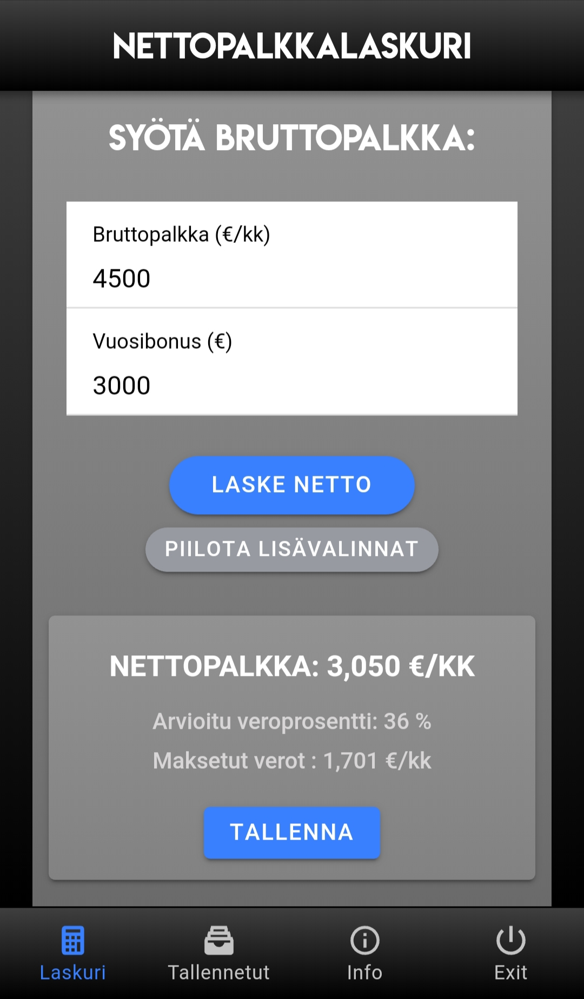
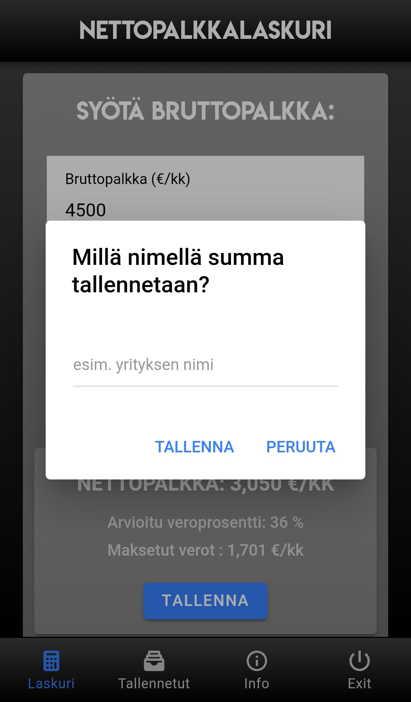
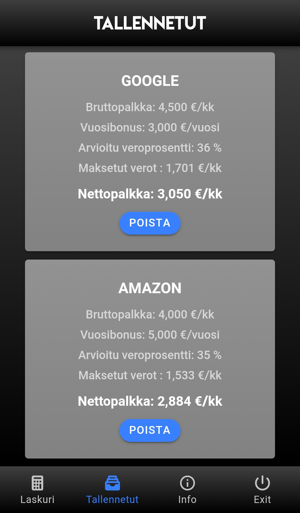

# Contract of employment evaluator

A mobile (hybrid) app to calculate contract's net worth after taxes, reductions and benefits

Available as an Android app in Play store: https://play.google.com/store/apps/details?id=com.test.nettopalkkalaskuri

## Current Features
* User can input monthly gross salary
* User can input yearly bonus
* Program calculates an estimate of the tax rate which the user would have with input salary
* Program calculates the monthly net salary
* User can save the calculation with a name id
* All saved items are displayed in a separate tab sorted by net value
* Items are saved to mobile devices's drive
* Items can be deleted
* Deployed to heroku as a PWA
* Support for English language
* Also available as a Android app in Play store

## Future Features
* User has the option to add more details to the calculations such as benefits or reductions
* Saved items can be edited

## Tech Used
* Ionic 4
* TypeScript
* JavaScript ES6
* HTML
* CSS

## Installation & Development
1. clone this repo: git clone `https://github.com/VillePajala/ionic-contract-of-employment-evaluator.git`
2. `cd ionic-contract-of-employment-evaluator`
3. run `npm install`
4. run `ionic serve` from a terminal to run in browser
5. To run on mobile device, install `ionic devapp`
6. Connect the mobile device and your development computer to same internet
7. Run `ionic serve --devapp`

## Screenshots

