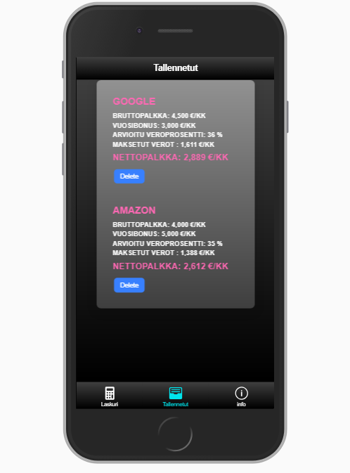

# Contract of employment evaluator

A mobile (hybrid) app to calculate contract's net worth after taxes, reductions and benefits

## Current Features

* User can input monthly gross salary
* Program calculates an estimate of the tax rate which the user would have with input salary
* Program calculates the monthly net salary
* User can save the calculation with a name id
* All saved items are displayed in a separate tab sorted by net value

## Future Features

* User has the option to add more details to the calculations such as benefits or reductions
* Saved items can be removed and edited
* User can create a account and save his/her data for future use

## Tech Used

* Ionic 4
* TypeScript
* JavaScript Es6
* HTML
* CSS

### Screenshots

